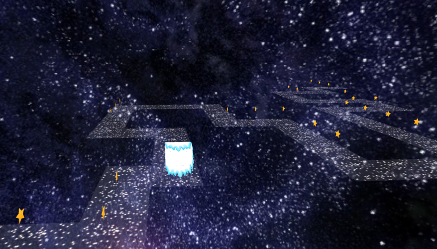

# IMA'GALAXY




Projet de synthèse d'image, programmation, et architecture logicielle lors du semestre 3 à l'IMAC, inspiré du jeu Temple Run.

## Librairies
Pour pouvoir compiler correctement le projet, les librairies SDL, OpenGL, et GLEW sont nécessaires.

## Compiler le projet
Créer un dossier build à l'emplacement désiré
```
mkdir build
cd build
```

Build le projet depuis le dossier du projet
```
cmake Temple_Run
```

Compiler le projet depuis le dossier build
```
make
```

Exécuter le jeu
```
./Test_Meshs/Test_Meshs_Test_GameManager
```